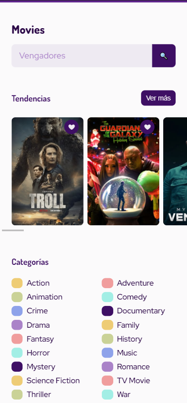

# [Movies App](https://jesusj1menez.github.io/movies-api/ 'Movies App')

  

Web application of movies for cell phones made with [TheMovieDB](https://developers.themoviedb.org/3/getting-started/introduction 'TheMovieDB') api with sections such as movie search, trends, categories, favorite movies and an individual view of each movie with its poster, name, rating, short summary, movie categories and similar movies .

